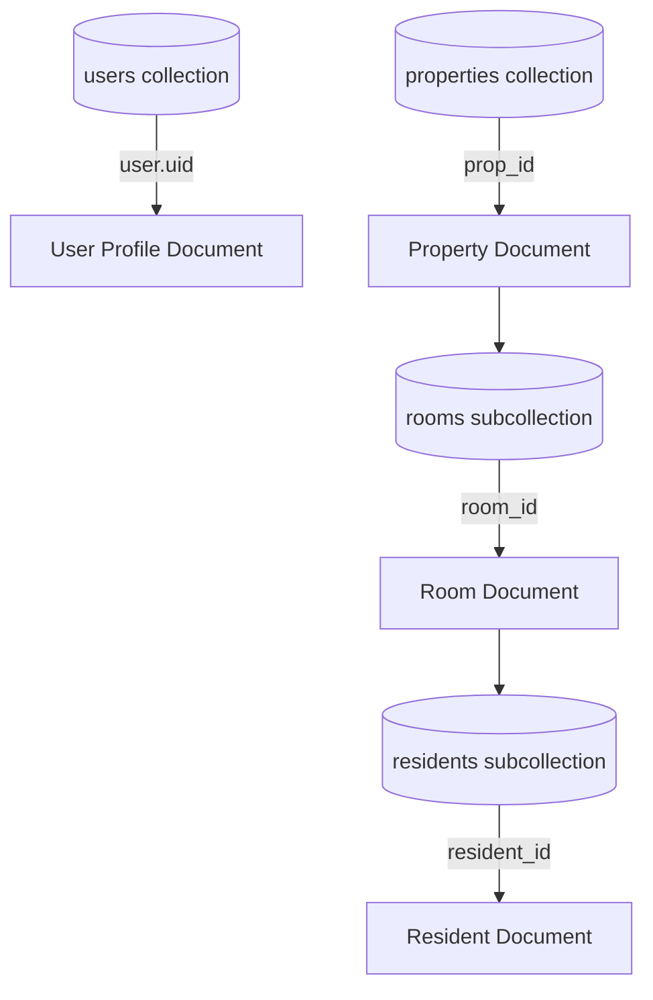

# StarVista — Hostel & PG Payment Tracker Documentation

Welcome to StarVista! This document serves as a comprehensive developer reference for understanding the project structure, design system, database schema, core workflows, and development guidelines.

---

## 1. Project Overview & Objective

StarVista is a lightweight Single Page Application (SPA) designed for hostel and PG owners to manage properties, rooms, and resident payments. Key capabilities include:
- Real-time resident tracking with payment status indicators (**Paid**, **Upcoming**, **Pending**).
- Room configuration with capacity limits.
- Integration with WhatsApp to send automated payment reminders.
- Dynamic data summaries (e.g., student counts, aggregated rent per payment status).
- Complete JSON-based data backups (import/export tool).

---

## 2. Database Migration (Import/Export Tool)

If a developer wishes to switch database instances, change the Firebase project configuration, or migrate the database to another backend:
- **Exporting Existing Data**: Navigate to the **Import-Export** screen (`import-export.html`) on the active environment to export all properties, rooms, and resident records as a structured JSON file.
- **Importing Into New Database**: After updating the Firebase project configuration (in `js/app.js`) to point to the new database, navigate to the `import-export.html` screen on the new environment and upload the exported JSON file to automatically seed and restore the entire nested dataset (properties -> rooms -> residents).

---

## 3. Tech Stack & Architecture

StarVista is built on a modern, dependencies-light frontend architecture:
- **Core**: Semantic HTML5 and Vanilla Javascript (ES6+).
- **Styling**: Vanilla CSS with custom property-based theme tokens (dark mode elements, glassmorphism card layouts, responsive grids).
- **Database**: Google Firebase Cloud Firestore (NoSQL realtime database).
- **Authentication**: Firebase Authentication (Email/Password).
- **Image Storage**: Cloudinary (Image uploads for hostel/property cards).
- **Router**: Client-side hash-based router (`#/login`, `#/properties`, `#/property/PROPERTY_ID`).

---

## 4. Directory Structure

```
STARVISTA_WEB/
├── css/
│   └── style.css            # Central styling system, theme variables, and keyframe animations
├── js/
│   ├── app.js               # Firebase & Cloudinary configuration, router, and auth guard
│   ├── auth.js              # Signup, login, password reset forms handling
│   ├── properties.js        # Property dashboard, CRUD, and Cloudinary uploads
│   ├── property.js          # Detail view: Room/Resident CRUD, sorting, filtering, batch operations
│   └── utils.js             # Shared helpers (date parsing, currency formatting, DOM creation)
├── index.html               # Main application template (contains all SPA screen segments)
├── import-export.html       # Migration hub for properties and nested room/resident import-export
└── DOCUMENTATION.md         # This developer guide
```

---

## 5. Firestore Database Schema

The Firestore database relies on a nested structure:



### Document Attributes

#### `users/{userId}`
- `name` (string): Full name of the property owner/user.
- `email` (string): Registered email address.
- `created_at` (server timestamp): Date of registration.

#### `properties/{propertyId}`
- `name` (string): Property title.
- `address` (string): Physical address or description.
- `image_url` (string): URL to uploaded hostel image.
- `owner_id` (string): Links to the user document.
- `total_rooms` (number): Number of rooms configured.

#### `properties/{propertyId}/rooms/{roomId}`
- `room_no` (string): Room identifier (e.g., `101`, `Deluxe A`).
- `capacity` (number): Total beds available in this room.

#### `properties/{propertyId}/rooms/{roomId}/residents/{residentId}`
- `name` (string): Resident's full name.
- `phone` (string): Resident's contact number (typically with Indian prefix `+91`).
- `monthly_rent` (number): Base rent value.
- `start_date` (timestamp): Rent cycle start date.
- `end_date` (timestamp): Rent cycle renewal date.
- `remarks` (string): Optional notes.

---

## 6. Core Application Logic & Workflows

### 6.1 Payment Status Logic
The application automatically calculates payment status based on a resident's `end_date`:
- **Paid**: `end_date` is more than 7 days in the future.
- **Upcoming**: `end_date` is between 0 and 7 days in the future.
- **Pending**: `end_date` is in the past.

*Refer to `getPaymentStatus(endDate)` in `js/utils.js`.*

### 6.2 Room Deletion (Safe Recursive Delete)
Because Firestore does not automatically delete nested subcollections when a parent document is removed, deleting a room must be handled carefully to avoid orphaned `residents` documents.
The application executes a Firestore Batch operation:
1. Queries all documents in the room's `residents` subcollection.
2. Appends deletion commands for all found residents to a batch.
3. Appends a deletion command for the room document itself.
4. Decrements `total_rooms` count on the parent property.
5. Commits the transaction atomically.

*Refer to `confirmDeleteRoom()` in `js/property.js`.*

### 6.3 Natural, Case-Insensitive Alphabetical Sorting
To keep the dashboard organized and handle mixed room titles (e.g., numeric values like `101` and textual names like `Deluxe A`), rooms are sorted using the natural alphanumeric order ignoring case:
```javascript
currentRooms.sort((a, b) => {
  const valA = String(a.data.room_no || '');
  const valB = String(b.data.room_no || '');
  return valA.localeCompare(valB, undefined, { numeric: true, sensitivity: 'base' });
});
```

*Refer to `sortRoomsAlphabetically()` in `js/property.js`.*

### 6.4 DOM Manipulation Helper
The application avoids heavy frameworks by using a functional utility to programmatically generate DOM elements:
`el(tag, attributes, children)`
- Attributes starting with `on` are mapped to Event Listeners (e.g. `onClick: () => {}`).
- The `className` attribute is converted to standard class assignment.

*Refer to `el()` in `js/utils.js`.*

---
